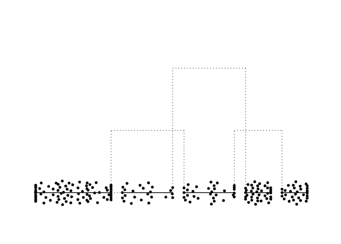
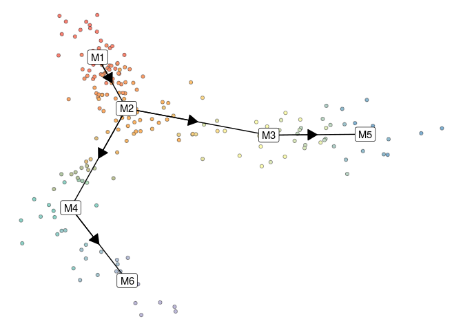
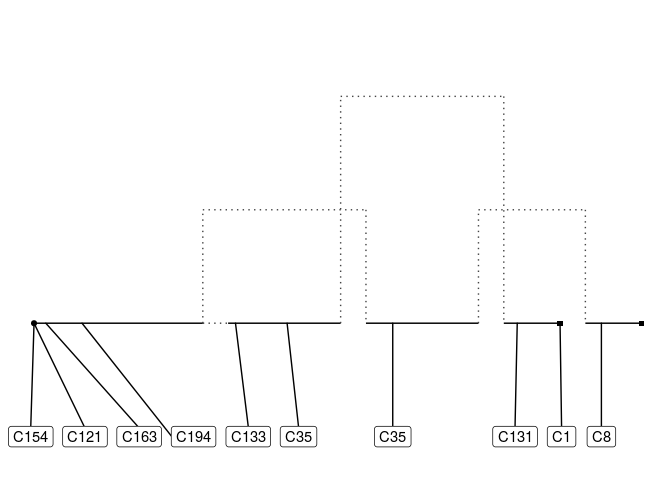
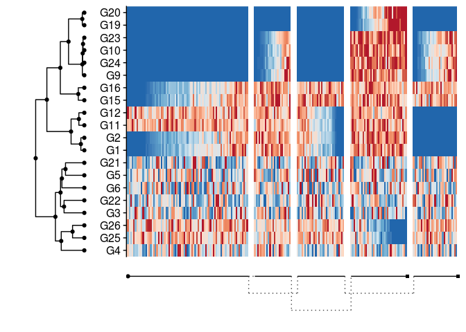
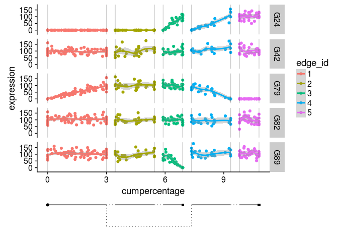
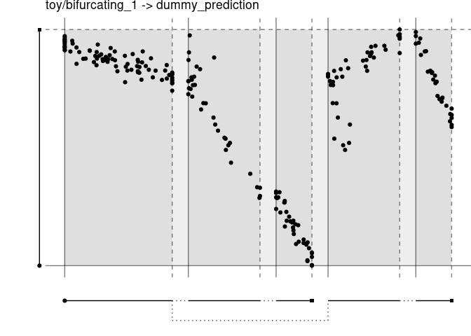

<!-- README.md is generated from README.Rmd. Please edit that file -->
dynplot
=======

**dynplot** provides common functionality for plotting trajectories.

Load in a toy dataset

    task <- toy_tasks %>% filter(trajectory_type == "bifurcation") %>% extract_row_to_list(1)

Plotting the topology and cellular positions
--------------------------------------------

In 2D

    plot_default(task)

In 1D

    plot_connections(task$milestone_network)

    plot_connections(task$milestone_network, cell_progressions = task$progressions %>% sample_n(10))

Plotting expression
-------------------

In a heatmap

    plot_heatmap(task)

In line plots

    plot_genes(task)

Comparing trajectories
----------------------

    pseudotime <- task$counts %>% prcomp() %>% {.$x[, 1]}
    prediction <- dynwrap::wrap_data("dummy_prediction", task$cell_ids) %>% 
      dynwrap::add_linear_trajectory_to_wrapper(pseudotime)

    plot_strip_connections(task, prediction)

