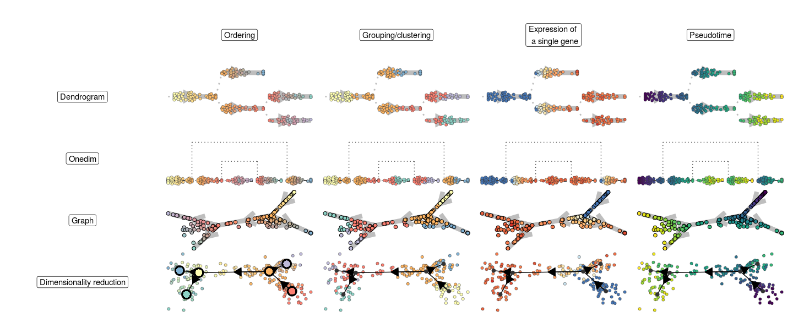
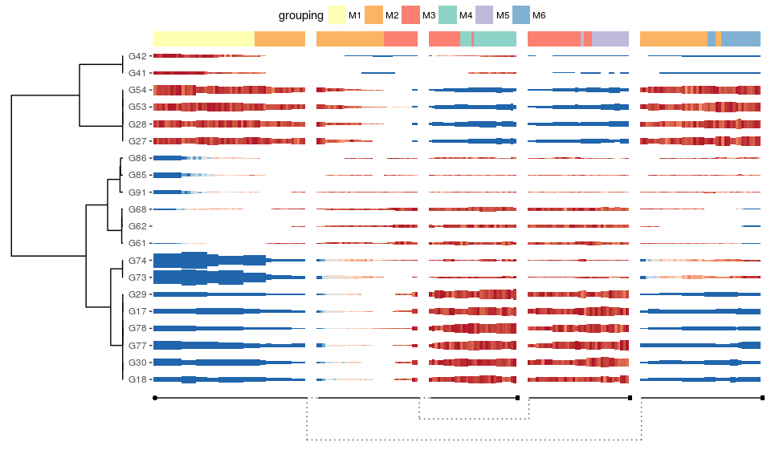

<!-- README.md is generated from README.Rmd. Please edit that file -->
dynplot
=======

**dynplot** provides common functionality for plotting trajectories.

The package provides different ways to plot both the topology and
cellular properties of a trajectory:

And to plot the expression and feature importances of many genes along
the trajectory

