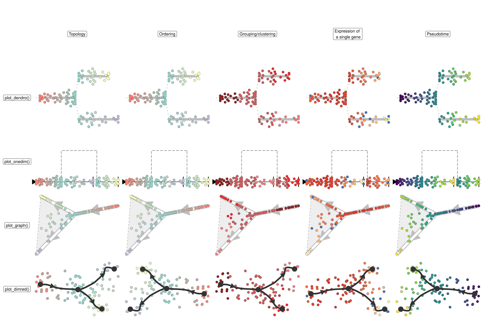

dynplot: Plotting Single-Cell Trajectories
================

<!-- README.md is generated from README.Rmd. Please edit that file -->

  
[**ℹ️ Tutorials**](https://dynverse.org)     [**ℹ️ Reference
documentation**](https://dynverse.org/reference/dynplot)
 

The package provides different ways of visualising single-cell
trajectories. This can be the trajectory topology itself, projected onto
a dimensionality reduction, using a heatmap, or a comparison between two
trajectories.

Here’s a summary of the provided plotting functions.

In addition, you can also plot the expression of genes along the
trajectory as a heatmap.

Or create a comparison plot between two trajectories for the same cells.

    #> Warning: Unknown or uninitialised column: `directed`.

## Latest changes

Check out `news(package = "dynwrap")` or [NEWS.md](NEWS.md) for a full
list of changes.

<!-- This section gets automatically generated from inst/NEWS.md -->

### Recent changes in dynplot 1.1.0

Initial release on CRAN.

-   MINOR CHANGE: Add `arrow` parameter to all plot functions.

-   BUG FIX: Apply fixes for new versions of tibble, tidyr, and ggraph.

-   BUG FIX `optimise_order()`: Fix problem where GA::ga() wouldn’t run
    on milestone networks with 4 edges.

-   BUG FIX `linearise_cells()`: Fix ordering issue when
    `equal_cell_width` is `TRUE`.

-   MINOR CHANGE: Clean imports and supposed undefined variables.

### Recent changes in dynplot 1.0.2 (04-07-2019)

-   BUG FIX: Fix weird ceiling warning.

-   BUG FIX: Fix for new select waypoints (\#41).

-   MINOR CHANGE: Added parameters `size_cells`, `alpha_cells` and
    `border_radius_percentage` to plotting functions that plot cells
    (\#40).
