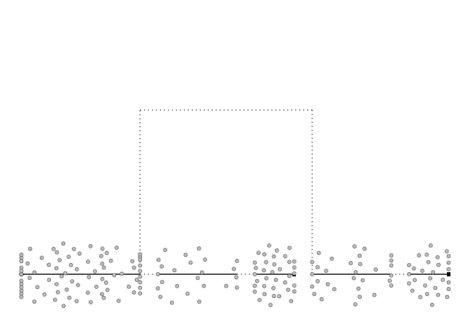
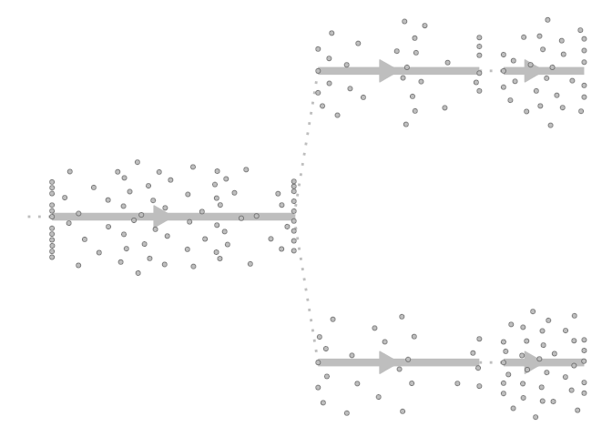
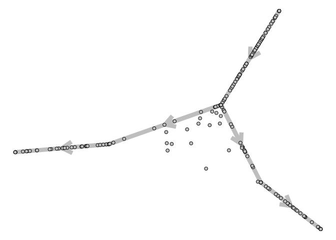
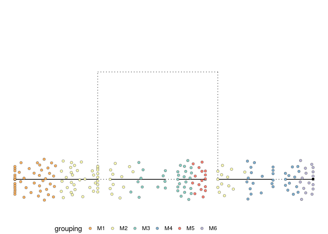
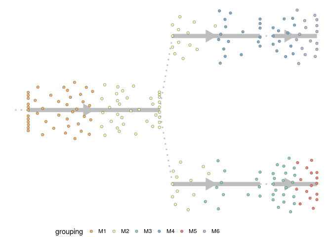
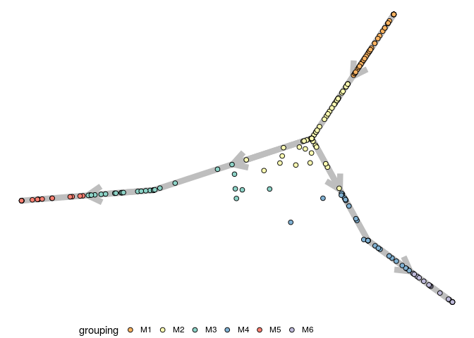
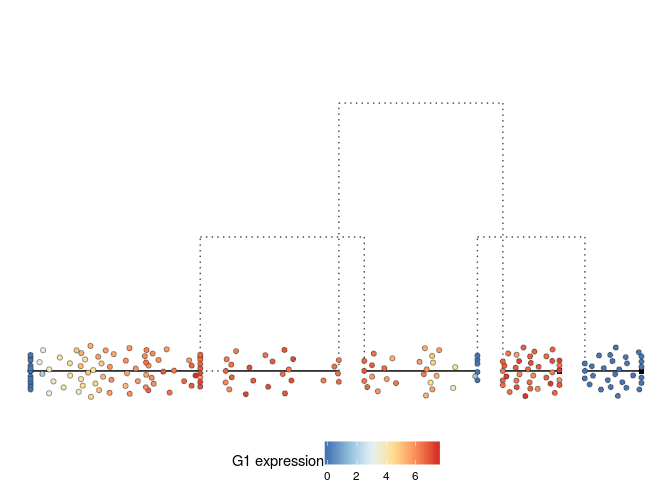
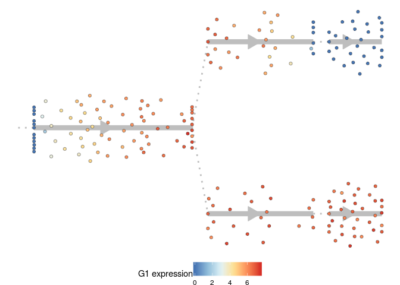
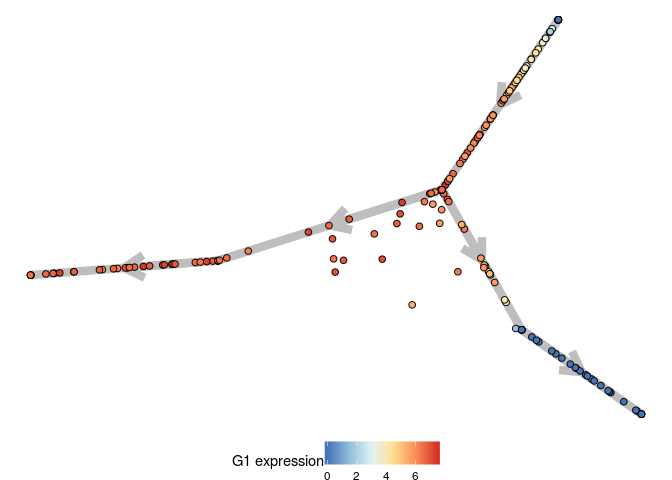
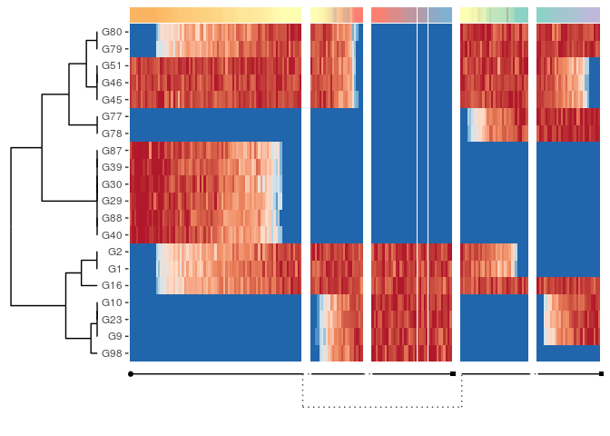

<!-- README.md is generated from README.Rmd. Please edit that file -->
dynplot
=======

**dynplot** provides common functionality for plotting trajectories.

Load in a toy dataset

    task <- toy_tasks %>% filter(trajectory_type == "bifurcation") %>% extract_row_to_list(1) %>% root_trajectory()

Plotting the topology and cellular positions
--------------------------------------------

If the topology is very simple (or should be represented in one
dimension)

    plot_onedim(task)

If the topology is a tree

    plot_dendro(task)

If the topology is more complex

    plot_graph(task)

    plot_topology(task)

Plotting a grouping
-------------------

    grouping_assignment <- task$prior_information$grouping_assignment

    plot_onedim(task, grouping_assignment=grouping_assignment)

    plot_dendro(task, grouping_assignment=grouping_assignment)

    plot_graph(task, grouping_assignment=grouping_assignment)

Plotting expression of one gene
-------------------------------

    gene_oi <- first(colnames(task$counts))

    plot_onedim(task, gene_oi = gene_oi)

    plot_dendro(task, gene_oi = gene_oi)

    plot_graph(task, gene_oi = gene_oi)

Plotting expression of a lot of genes
-------------------------------------

    plot_heatmap(task)

    # plot_genes(task)

Comparing trajectories
----------------------

    pseudotime <- task$counts %>% prcomp() %>% {.$x[, 1]}
    prediction <- dynwrap::wrap_data("dummy_prediction", task$cell_ids) %>%
      dynwrap::add_linear_trajectory_to_wrapper(pseudotime)

    plot_strip_onedim(task, prediction)

