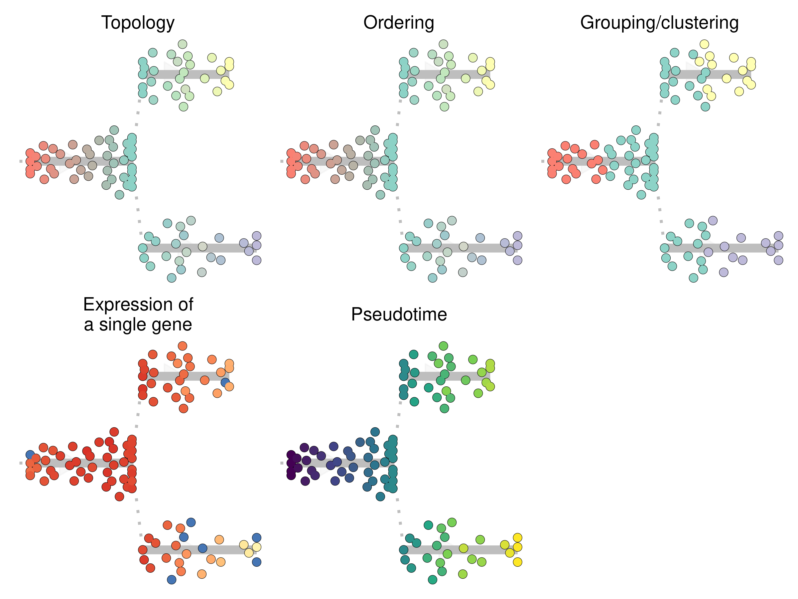
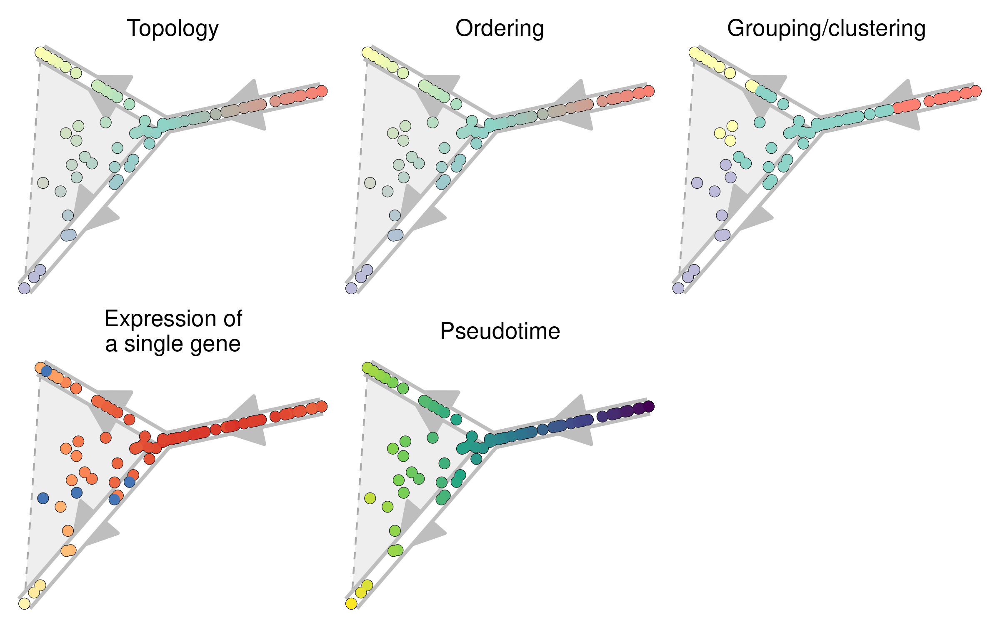
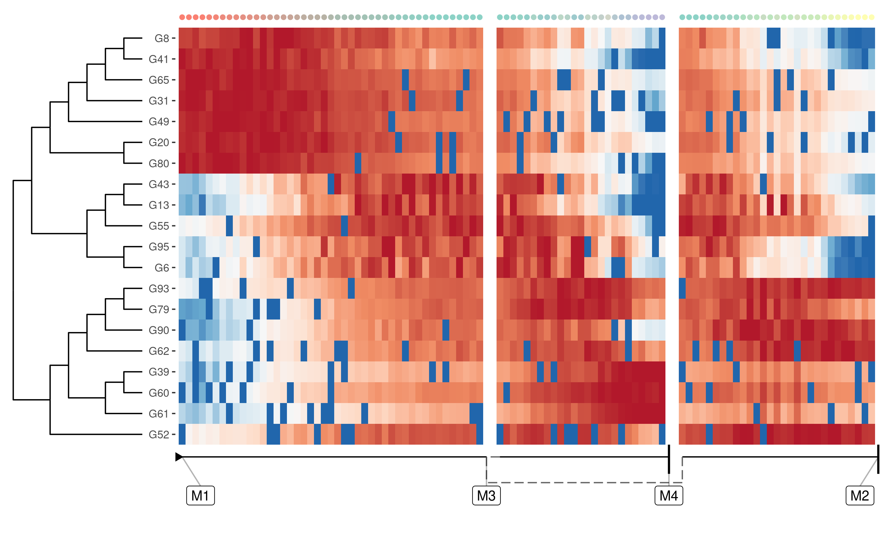
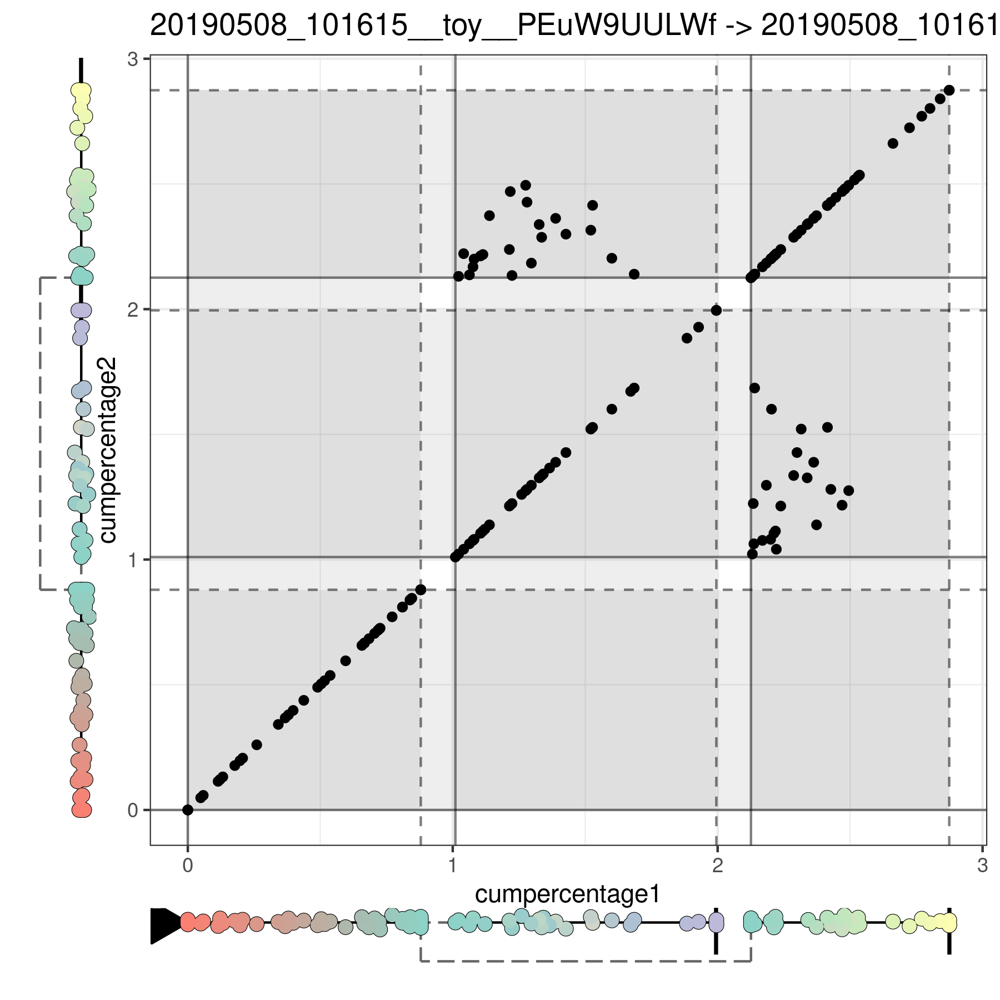

dynplot: Plotting Single-Cell Trajectories
================

<!-- README.md is generated from README.Rmd. Please edit that file -->

<a href="https://github.com/dynverse/dynplot/actions?query=workflow%3AR-CMD-check"></a>
<a href="https://codecov.io/gh/dynverse/dynplot"></a>  
[**ℹ️ Tutorials**](https://dynverse.org)     [**ℹ️ Reference
documentation**](https://dynverse.org/reference/dynplot)
<br>

Visualise a single-cell trajectory as a graph or dendrogram, as a
dimensionality reduction or heatmap of the expression data, or a
comparison between two trajectories as a pairwise scatterplot or
dimensionality reduction projection.

Here’s a summary of the different plotting functions for visualising
single-cell trajectories.

``` r
library(tidyverse)
library(dyno)

# get trajectory
data(example_bifurcating)

trajectory <- example_bifurcating %>% add_root()

# gather some prior information
grouping <- trajectory$prior_information$groups_id

groups <- tibble(
  group_id = trajectory$milestone_ids,
  color = dynplot:::milestone_palette_list$auto(length(group_id))
)
features_oi <- apply(as.matrix(trajectory$counts), 2, sd) %>% sort() %>% names() %>% tail(10)
feature_oi <- features_oi[[10]]
```

## `plot_dendro()`: Plot a trajectory as a dendrogram

``` r
patchwork::wrap_plots(
  plot_dendro(trajectory) + labs(title = "Topology"),
  plot_dendro(trajectory, "milestone") + labs(title = "Ordering"),
  plot_dendro(trajectory, grouping=grouping, groups=groups) + labs(title = "Grouping/clustering"),
  plot_dendro(trajectory, feature_oi=feature_oi) + labs(title = "Expression of\na single gene"),
  plot_dendro(trajectory, "pseudotime") + labs(title = "Pseudotime"),
  byrow = TRUE,
  ncol = 3
) & theme(legend.position = "none")
```



## `plot_onedim()`: Plot a trajectory as a one-dimensional set of connected segments

``` r
patchwork::wrap_plots(
  plot_onedim(trajectory) + labs(title = "Topology"),
  plot_onedim(trajectory, "milestone") + labs(title = "Ordering"),
  plot_onedim(trajectory, grouping=grouping, groups=groups) + labs(title = "Grouping/clustering"),
  plot_onedim(trajectory, feature_oi=feature_oi) + labs(title = "Expression of\na single gene"),
  plot_onedim(trajectory, "pseudotime") + labs(title = "Pseudotime"),
  byrow = TRUE,
  ncol = 2
) & theme(legend.position = "none")
```


## `plot_graph()`: Plot a trajectory and cellular positions as a graph

``` r
patchwork::wrap_plots(
  plot_graph(trajectory) + labs(title = "Topology"),
  plot_graph(trajectory, "milestone") + labs(title = "Ordering"),
  plot_graph(trajectory, grouping=grouping, groups=groups) + labs(title = "Grouping/clustering"),
  plot_graph(trajectory, feature_oi=feature_oi) + labs(title = "Expression of\na single gene"),
  plot_graph(trajectory, "pseudotime") + labs(title = "Pseudotime"),
  byrow = TRUE,
  ncol = 3
) & theme(legend.position = "none")
```



## `plot_dimred()`: Plot a trajectory in a (given) dimensionality reduction

``` r
patchwork::wrap_plots(
  plot_dimred(trajectory) + labs(title = "Topology"),
  plot_dimred(trajectory, "milestone") + labs(title = "Ordering"),
  plot_dimred(trajectory, grouping=grouping, groups=groups) + labs(title = "Grouping/clustering"),
  plot_dimred(trajectory, feature_oi=feature_oi) + labs(title = "Expression of\na single gene"),
  plot_dimred(trajectory, "pseudotime") + labs(title = "Pseudotime"),
  byrow = TRUE,
  ncol = 3
) & theme(legend.position = "none")
```


## `plot_heatmap()`: Plot expression data along a trajectory

In addition, you can also plot the expression of genes along the
trajectory as a heatmap.

``` r
plot_heatmap(trajectory, grouping = trajectory$prior_information$grouping_assignment)
```



## `plot_linearised_comparison()`: Compare two trajectories as a pseudotime scatterplot

You can compare multiple trajectories (for the same cells) by creating a
scatterplot between the two trajectories.

``` r
prediction <- infer_trajectory(trajectory, ti_comp1())
#> v0.9.9.01: Pulling from dynverse/ti_comp1
#> 844c33c7e6ea: Pulling fs layer
#> 4f11e4e30170: Pulling fs layer
#> a9724dff2655: Pulling fs layer
#> f5f3a048c9c3: Pulling fs layer
#> a53c4db932de: Pulling fs layer
#> bd5da474b8ba: Pulling fs layer
#> be9b916e18e7: Pulling fs layer
#> b8b469f67972: Pulling fs layer
#> e33132a1a81b: Pulling fs layer
#> 32bd550d2fc1: Pulling fs layer
#> a828ddf00b38: Pulling fs layer
#> d97023e2f782: Pulling fs layer
#> 84d8340a282e: Pulling fs layer
#> be9b916e18e7: Waiting
#> e33132a1a81b: Waiting
#> 32bd550d2fc1: Waiting
#> a828ddf00b38: Waiting
#> a53c4db932de: Waiting
#> b8b469f67972: Waiting
#> f5f3a048c9c3: Waiting
#> bd5da474b8ba: Waiting
#> d97023e2f782: Waiting
#> 844c33c7e6ea: Verifying Checksum
#> 844c33c7e6ea: Download complete
#> 844c33c7e6ea: Pull complete
#> f5f3a048c9c3: Verifying Checksum
#> f5f3a048c9c3: Download complete
#> a53c4db932de: Verifying Checksum
#> a53c4db932de: Download complete
#> bd5da474b8ba: Verifying Checksum
#> bd5da474b8ba: Download complete
#> be9b916e18e7: Download complete
#> 4f11e4e30170: Verifying Checksum
#> 4f11e4e30170: Download complete
#> 4f11e4e30170: Pull complete
#> e33132a1a81b: Verifying Checksum
#> e33132a1a81b: Download complete
#> a9724dff2655: Verifying Checksum
#> a9724dff2655: Download complete
#> 32bd550d2fc1: Verifying Checksum
#> 32bd550d2fc1: Download complete
#> a9724dff2655: Pull complete
#> f5f3a048c9c3: Pull complete
#> a53c4db932de: Pull complete
#> bd5da474b8ba: Pull complete
#> be9b916e18e7: Pull complete
#> a828ddf00b38: Verifying Checksum
#> a828ddf00b38: Download complete
#> 84d8340a282e: Verifying Checksum
#> 84d8340a282e: Download complete
#> d97023e2f782: Download complete
#> b8b469f67972: Verifying Checksum
#> b8b469f67972: Download complete
#> b8b469f67972: Pull complete
#> e33132a1a81b: Pull complete
#> 32bd550d2fc1: Pull complete
#> a828ddf00b38: Pull complete
#> d97023e2f782: Pull complete
#> 84d8340a282e: Pull complete
#> Digest: sha256:012b3bfef2250767bcd3f3b389ebff82d4a2dc23d39b1bdadf7076e23b833680
#> Status: Downloaded newer image for dynverse/ti_comp1:v0.9.9.01
#> docker.io/dynverse/ti_comp1:v0.9.9.01

trajectory$id <- "Bifurcating"
prediction$id <- "Linear"
plot_linearised_comparison(trajectory, prediction)
```



<!--

TODO: create dedicated function for this
## Alternative: Compare two trajectories by projecting dimensionality reductions

You can also use the colouring of the cells in order to compare two trajectories.

{r dimredcompare}
traj1 <- trajectory %>% dynwrap::add_dimred(dimred = dyndimred::dimred_landmark_mds)
traj2 <- prediction %>% dynwrap::add_dimred(dimred = dyndimred::dimred_landmark_mds, expression_source = trajectory)

plot_dimred(traj1, milestone_percentages = traj2$milestone_percentages, milestones = traj2$milestone_ids)
plot_dimred(
  traj2,
  expression_source = traj1,
  color_cells = "milestone",
  milestones = traj1$milestone_ids,
  milestone_percentages = traj1$milestone_percentages
)


-->

## Latest changes

Check out `news(package = "dynwrap")` or [NEWS.md](NEWS.md) for a full
list of changes.

<!-- This section gets automatically generated from inst/NEWS.md -->

### Recent changes in dynplot 1.1.1

-   BUG FIX `project_waypoints_coloured()`: Fix refactoring issue “Must
    supply a symbol or a string as argument” (\#54).

-   BUG FIX `project_waypoints_coloured()`: Fix wrong results when
    projecting waypoint segments (\#54 bis).

### Recent changes in dynplot 1.1.0

Initial release on CRAN.

-   MINOR CHANGE: Add `arrow` parameter to all plot functions.

-   BUG FIX: Apply fixes for new versions of tibble, tidyr, and ggraph.

-   BUG FIX `optimise_order()`: Fix problem where GA::ga() wouldn’t run
    on milestone networks with 1 or 4 edges.

-   BUG FIX `linearise_cells()`: Fix ordering issue when
    `equal_cell_width` is `TRUE`.

-   MINOR CHANGE: Clean imports and supposed undefined variables.

-   MINOR CHANGE `plot_dendro()`: Allow plotting of disconnected graphs
    (\#32). This assumes that
    `dynwrap::add_root(traj, root_milestone_id = c(...))` has been
    called properly.

-   DOCUMENTATION: Extend documentation on usage of parameters and the
    expected output values of functions.
