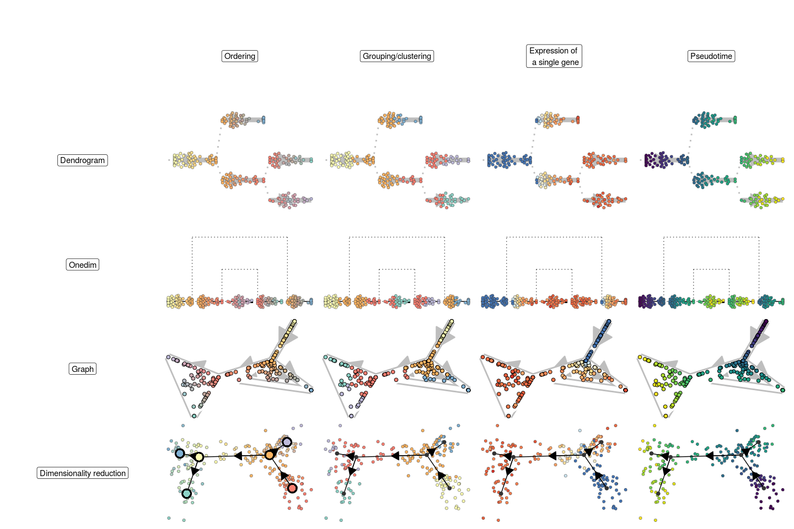
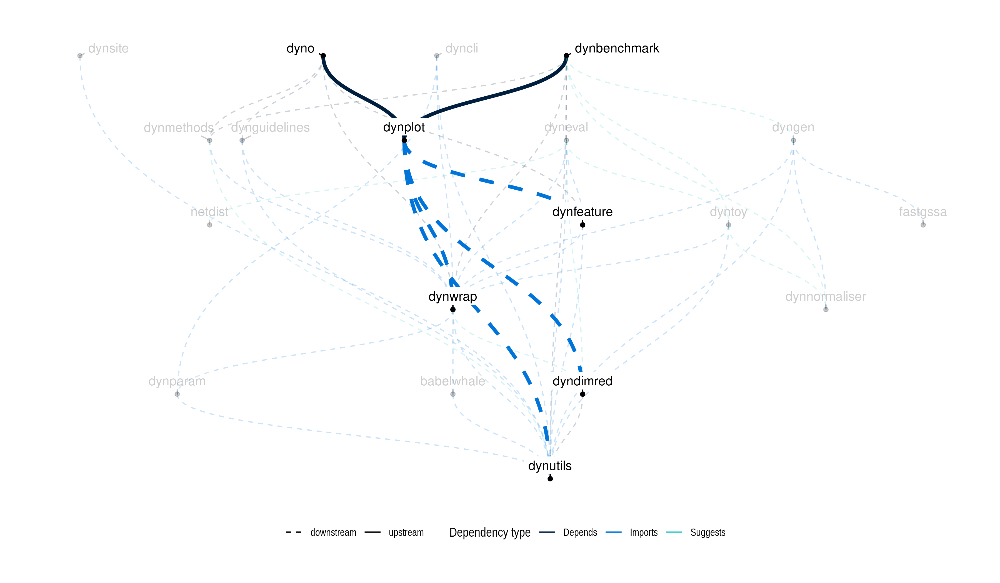

<!-- README.md is generated from README.Rmd. Please edit that file -->

<a href="https://travis-ci.org/dynverse/dynplot"></a>
<a href="https://codecov.io/gh/dynverse/dynplot">
</a>
[**ℹ️ Tutorials**](https://dynverse.org)     [**ℹ️ Reference
documentation**](https://dynverse.org/reference/dynplot)
<br>

# Common visualisation tools for single-cell trajectories

## Installation

``` r
devtools::install_github("dynverse/dynplot")
```

On linux, udunits2 has to be installed:

  - Debian / Ubuntu / Linux mint: `sudo apt-get install libudunits2-dev`
  - Fedora / CentOS: `sudo dnf install udunits2-devel`

## Usage

The package provides different ways to plot both the topology and
cellular properties of a trajectory:

<!-- -->

And to plot the expression and feature importances of many genes along
the trajectory

<!-- -->

## Latest changes

Check out `news(package = "dynwrap")` or [NEWS.md](inst/NEWS.md) for a
full list of
changes.

<!-- This section gets automatically generated from inst/NEWS.md, and also generates inst/NEWS -->

### Recent changes in dynplot 1.0.0 (28-03-2019)

  - Initial release of dynplot
  - Plotting of trajectories
  - Compatible with all methods of
dynmethods

## Dynverse dependencies

<!-- Generated by "update_dependency_graphs.R" in the main dynverse repo -->


